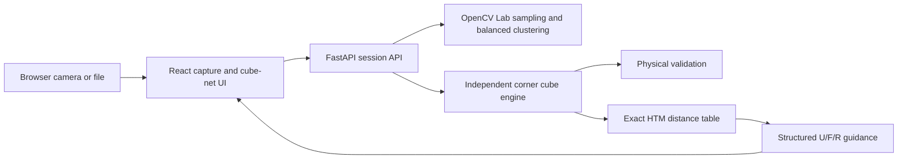

# Rubik's 2×2 Camera Solver

A local web application that scans all six faces of a physical 2×2×2 cube, shows recognized colors
immediately, validates the physical state, computes a shortest solution, and guides each turn with
fixed camera overlays. A valid six-face scan goes directly to the solution; detailed correction is
an optional recovery tool.

The repository is intentionally named `rubicks-solver`. The application supports red, blue, orange,
white, green, and yellow cubes with default opposites white/yellow, red/orange, and green/blue.

## MVP features and limitations

- Guided `F → R → B → L → U → D` capture with automatic hold-to-capture, manual capture,
  or image files.
- Classical Lab color sampling, balanced six-color clustering, confidence, and quality warnings.
- A persistent six-face preview strip with provisional/final labels, confidence, warnings, and
  non-destructive per-face retakes.
- Targeted invalid-scan recovery plus an optional cube-net editor with face rotation and counts.
- Detailed physical-state validation and likely face-rotation suggestions.
- Original optimal 2×2 solver in the Half Turn Metric (HTM).
- A live colored U/F/R camera ghost, full formula, projected arrows, and physically safe manual
  confirmation, undo, and restart.
- A camera-free demo that exercises the real API from scramble to solved.

This controlled MVP is not unrestricted markerless AR. It does not detect a cube anywhere in the
scene, estimate 3D pose, track hands, or verify turns automatically. Good diffuse lighting and careful
alignment are still important. It supports one in-memory user/session and the default opposite pairs.

## Architecture



The backend never persists camera images. It keeps only four Lab samples and quality metadata per
face in a UUID session, expiring after 30 minutes. The React frontend owns camera permission, image
capture, correction, and the solution state machine. OpenAPI documentation is available at
`http://127.0.0.1:8000/docs` while the backend is running.

## Cube orientation and solver

Every captured face is indexed as viewed directly toward it:

```text
0 1
2 3
```

Scan Front. Rotate the **whole cube** left for Right, left again for Back, and left again for Left.
Return to Front and tilt the whole cube down for Up; return and tilt it up for Down. Never turn a
layer during scanning. The UI repeats these directions for every face.

A 2×2 has no centers. The engine therefore uses the three stickers currently at the geometric DBL
(down/back/left) corner as a deterministic reference, maps their opposites to U/F/R, and validates
all other corners. This supports either color-scheme handedness and accepts a solved cube in any
global rotation.

The solver fixes DBL and indexes the remaining state as `7! × 3^6 = 3,674,160` states. A reverse BFS
stores the exact distance for every state. It returns a shortest sequence using U, R, and F turns;
these three faces remain visible in the guidance view. In HTM, `R`, `R'`, and `R2` each count as one
move. Whole-cube positioning does not count. The generated solution is applied and verified before
the API returns it.

## Prerequisites and installation

- macOS or Linux
- `uv` and Python 3.12+
- Node.js 22+ and npm
- GNU Make

```bash
make install
```

This installs locked backend/frontend dependencies and generates the versioned solver table under
the ignored `.cache/solver` directory. Regenerate it with `make solver-table`.

## Run locally

```bash
make dev
```

Open [http://127.0.0.1:5173](http://127.0.0.1:5173). The Vite frontend proxies `/api` to FastAPI at
`http://127.0.0.1:8000`. Browser camera APIs work on localhost without a custom TLS certificate.

### Run on an iPhone over Wi-Fi

An iPhone must use trusted HTTPS for camera access; a plain `http://<LAN-IP>` URL is not sufficient.
The supported local flow uses [mkcert](https://github.com/FiloSottile/mkcert) and keeps FastAPI bound
to loopback behind Vite's same-origin proxy.

1. Connect the Mac and iPhone to the same Wi-Fi network. Install the certificate tool:

   ```bash
   brew install mkcert
   # Optional, for a terminal QR code:
   brew install qrencode
   ```

2. Generate a certificate containing the Mac's current Wi-Fi address:

   ```bash
   make mobile-cert
   ```

   macOS may request an administrator password while `mkcert -install` adds its local root. If the
   command was launched non-interactively and prints a trust warning, run `mkcert -install` once in
   your own terminal, then rerun `make mobile-cert`.

3. Run `mkcert -CAROOT`, open that directory, and transfer **only** `rootCA.pem` to the iPhone
   (AirDrop is convenient). Never transfer or share `rootCA-key.pem`.
4. On the iPhone, open the transferred file and install the downloaded profile under
   **Settings → General → VPN & Device Management**. Then open
   **Settings → General → About → Certificate Trust Settings** and enable full trust for the
   mkcert root. Apple requires this separate full-trust step for manually installed roots.
5. Start the mobile server:

   ```bash
   make dev-mobile
   ```

6. Open the printed `https://<LAN-IP>:5173` address in Safari, or scan the terminal QR code. Accept
   Safari's camera prompt after tapping **Allow camera**.

Certificates and keys are stored only in the ignored `.certs/` directory. If Wi-Fi changes the
Mac's IP address, rerun `make mobile-cert`. If Safari still reports an untrusted connection, verify
that the profile is installed, full trust is enabled, and the URL exactly matches the printed IP.
See [Apple's certificate trust instructions](https://support.apple.com/en-us/102390) and
[MDN's secure-context requirement](https://developer.mozilla.org/en-US/docs/Web/API/MediaDevices/getUserMedia).

## Using the application

1. Choose **Start scanning**, grant permission, and align each face inside the 2×2 square.
2. Hold steady for roughly 0.65 seconds while the readiness bar fills. Typical usable captures
   complete in about 0.5–0.9 seconds once framing and movement settle. Auto capture is on by
   default; manual capture and file upload remain available and commit immediately.
3. Check each new four-sticker preview. Labels are **Provisional** until all six faces are available,
   then become globally balanced **Final** labels. A warning asks for attention but does not erase a
   usable face. Choose **Retake** on any card without losing the other captures.
4. After Down is captured, validation and optimal solving run automatically. A valid scan skips the
   editor. If validation finds a physical conflict, only likely faces are highlighted; retake one or
   choose **Advanced correction** for the full cube net.
5. Tap **Start camera guidance**, then hold the cube so its real colors match the Up/Front/Right
   ghost. Choose **Orientation matched**. Camera-free schematic guidance remains available.
6. Follow the highlighted face and slim animated arrow. Its contrasted arrowhead points along the
   turn path; prime arrows reverse the path, and double turns carry a clear 180° badge. Guidance
   advances after a visible three-second countdown by default, while **Manual advance** keeps
   **Done / Next** fully user-controlled. Clockwise is always defined while looking directly at the
   named face. **Previous / Undo** and **Restart safely** pause the timer and guide actual inverse
   turns before changing displayed progress.
7. After the final move, the AR overlay disappears while the live camera stays visible behind a
   compact success banner and brief reduced-motion-aware confetti. Choose **Solve another cube** to
   stop the current camera and begin again.

For camera-free testing, choose **Try demo without camera**. **Enter manually** starts from a valid
solved net that can be edited. During scanning, **Upload image** works when camera access is absent.

## Camera troubleshooting

- Confirm the page is on `localhost` or `127.0.0.1`, then retry permission in browser site settings.
- Close other applications using the camera and reload after changing permissions.
- On a phone, choose the rear camera from the selector if the browser does not honor the preference.
- If Safari was backgrounded or the preview freezes, return to the page and tap **Recover camera**.
- Use diffuse light, avoid a bright point reflection, fill the square, and keep borders outside each
  sticker's central sample area.
- Slight softness, low light, or imperfect centering can be accepted with a visible warning. Near-black,
  clipped/glared, severely blurred, or badly framed candidates remain blockers. If auto capture is
  inconvenient, turn it off and use **Capture manually**; there is no second confirmation step.
- A short motion spike pauses the hold instead of discarding all progress. After capture, show a
  meaningfully different face to rearm; the app remembers a scene change even during processing.
- If no video device exists, use six image files or the demo/manual modes.

Add `?captureDebug=1` to the application URL to show raw metrics, thresholds, smoothed motion,
rolling hold state, cooldown, and scene-change status. This opt-in panel is intended for camera
tuning and does not send diagnostics anywhere.

## Development and tests

```bash
make lint       # Ruff, formatting check, ESLint, TypeScript
make test       # pytest/Hypothesis and Vitest
make test-e2e   # real API mobile demo plus deterministic synthetic-camera flows
make build      # production frontend build
make mobile-cert # generate ignored LAN certificates with mkcert
make dev-mobile  # trusted HTTPS frontend on Wi-Fi; backend remains loopback-only
```

Generate original visual fixtures with:

```bash
uv run --project backend python scripts/generate_test_images.py
```

Backend tests cover moves and inverses, coordinate/facelet round trips, random scrambles, exact
solver distances, invalid cubes, image quality, uploads, sessions, validation, and solve responses.
Frontend tests cover editing, rotation, runtime API parsing, auto-capture hysteresis, camera errors,
all nine projected moves, authoritative guidance progression, previews, manual commit policy,
targeted recovery, and complete mobile flows. The camera flow runs deterministically in mobile
Chromium; the camera-free demo also runs in mobile WebKit. CI requires no camera, certificates, or
secrets. Browser emulation is not reported as a physical iPhone result.

## Branch and rollback policy

`master` is the sole active development and deployment branch and the GitHub default branch. Work is
committed and pushed directly to `master`; this project does not use a deployment pull request. To
roll back a shipped change while keeping history auditable, use `git revert <commit>` on `master`,
run the verification commands above, and push the resulting revert commit. Generated certificates,
solver tables, test images, credentials, and environment files must remain untracked.

### Physical iPhone verification checklist

Browser emulation does not substitute for this checklist. Complete it on each representative iPhone
before describing the feature as physically verified:

- [ ] HTTPS opens without a certificate warning and Safari grants rear-camera permission.
- [ ] Portrait/landscape rotation, safe areas, bottom controls, and keyboard do not obscure actions.
- [ ] Preview resumes after backgrounding Safari and camera switching releases the previous device.
- [ ] All six faces auto-capture once, reject blur/glare, and require scene change between faces.
- [ ] Colored U/F/R calibration matches the scanned cube and every supported arrow is unambiguous.
- [ ] Confirm, Previous/Undo, and Restart keep the physical cube aligned with the displayed state.

This checklist has not yet been run on a physical iPhone in the current development environment.

## Repository structure

```text
backend/app/cube/       independent cube model, validation, and solver
backend/app/vision/     image sampling and color classification
backend/app/sessions/   expiring in-memory session store
backend/app/api/        Pydantic schemas and FastAPI routes
frontend/src/camera/    camera ROI capture and upload fallback
frontend/src/cube/      cube-net logic and editor
frontend/src/guidance/  move projection, arrows, undo, restart
test-data/              original generated fixtures and states
scripts/                local development and fixture generation
```

## Privacy, security, and licensing

Images are processed locally, discarded after sampling, and never sent to an external service. The
API accepts only JPEG, PNG, or WebP files up to 5 MB, caps decoded pixels, and restricts CORS to the
two documented frontend origins. There are no accounts, cookies, analytics, telemetry, or secrets.

The project is MIT licensed. Direct runtime dependencies use permissive licenses; their code is not
copied into this repository. The solver is an original implementation. See [LICENSE](LICENSE) and
the recorded [direct dependency license audit](THIRD_PARTY_LICENSES.md).

## Future improvements

Potential follow-ups include five-face inference, per-device color calibration,
`solvePnP` pose estimation, continuous turn verification, hand-occlusion handling, alternative color
schemes, PWA support, speech instructions, and 3×3×3 support.
