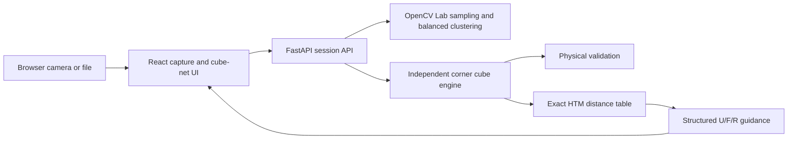

# Rubik's 2×2 Camera Solver

A local web application that scans all six faces of a physical 2×2×2 cube, lets you correct the
recognized colors, validates the physical state, computes a shortest solution, and guides each turn
with fixed camera overlays.

The repository is intentionally named `rubicks-solver`. The application supports red, blue, orange,
white, green, and yellow cubes with default opposites white/yellow, red/orange, and green/blue.

## MVP features and limitations

- Guided `F → R → B → L → U → D` capture with camera or image files.
- Classical Lab color sampling, balanced six-color clustering, confidence, and quality warnings.
- Clickable cube-net correction, face rotation, color counts, and scan retakes.
- Detailed physical-state validation and likely face-rotation suggestions.
- Original optimal 2×2 solver in the Half Turn Metric (HTM).
- Fixed U/F/R face highlights and projected arrows with manual confirmation, undo, and restart.
- A camera-free demo that exercises the real API from scramble to solved.

This controlled MVP is not unrestricted markerless AR. It does not detect a cube anywhere in the
scene, estimate 3D pose, track hands, or verify turns automatically. Good diffuse lighting and careful
alignment are still important. It supports one in-memory user/session and the default opposite pairs.

## Architecture



The backend never persists camera images. It keeps only four Lab samples and quality metadata per
face in a UUID session, expiring after 30 minutes. The React frontend owns camera permission, image
capture, correction, and the solution state machine. OpenAPI documentation is available at
`http://127.0.0.1:8000/docs` while the backend is running.

## Cube orientation and solver

Every captured face is indexed as viewed directly toward it:

```text
0 1
2 3
```

Scan Front. Rotate the **whole cube** left for Right, left again for Back, and left again for Left.
Return to Front and tilt the whole cube down for Up; return and tilt it up for Down. Never turn a
layer during scanning. The UI repeats these directions for every face.

A 2×2 has no centers. The engine therefore uses the three stickers currently at the geometric DBL
(down/back/left) corner as a deterministic reference, maps their opposites to U/F/R, and validates
all other corners. This supports either color-scheme handedness and accepts a solved cube in any
global rotation.

The solver fixes DBL and indexes the remaining state as `7! × 3^6 = 3,674,160` states. A reverse BFS
stores the exact distance for every state. It returns a shortest sequence using U, R, and F turns;
these three faces remain visible in the guidance view. In HTM, `R`, `R'`, and `R2` each count as one
move. Whole-cube positioning does not count. The generated solution is applied and verified before
the API returns it.

## Prerequisites and installation

- macOS or Linux
- `uv` and Python 3.12+
- Node.js 22+ and npm
- GNU Make

```bash
make install
```

This installs locked backend/frontend dependencies and generates the versioned solver table under
the ignored `.cache/solver` directory. Regenerate it with `make solver-table`.

## Run locally

```bash
make dev
```

Open [http://127.0.0.1:5173](http://127.0.0.1:5173). The Vite frontend proxies `/api` to FastAPI at
`http://127.0.0.1:8000`. Browser camera APIs work on localhost without a custom TLS certificate.

## Using the application

1. Choose **Start scanning**, grant permission, and align each face inside the 2×2 square.
2. Capture one face at a time, following whole-cube orientation instructions.
3. On the cube net, click a facelet and choose its actual color. Rotate or retake faces as needed.
4. Confirm every color count is 4, then choose **Validate and solve**.
5. Hold the cube so Up, Front, and Right match the fixed three-face guide.
6. Perform the highlighted move and press **Done / Next**. Clockwise means looking directly at the
   named face. **Previous / Undo** guides a real inverse move rather than only changing the screen.

For camera-free testing, choose **Try demo without camera**. **Enter manually** starts from a valid
solved net that can be edited. During scanning, **Upload image** works when camera access is absent.

## Camera troubleshooting

- Confirm the page is on `localhost` or `127.0.0.1`, then retry permission in browser site settings.
- Close other applications using the camera and reload after changing permissions.
- On a phone, choose the rear camera from the selector if the browser does not honor the preference.
- Use diffuse light, avoid a bright point reflection, fill the square, and keep borders outside each
  sticker's central sample area.
- If no video device exists, use six image files or the demo/manual modes.

## Development and tests

```bash
make lint       # Ruff, formatting check, ESLint, TypeScript
make test       # pytest/Hypothesis and Vitest
make test-e2e   # real FastAPI + React demo flow in Chromium
make build      # production frontend build
```

Generate original visual fixtures with:

```bash
uv run --project backend python scripts/generate_test_images.py
```

Backend tests cover moves and inverses, coordinate/facelet round trips, random scrambles, exact
solver distances, invalid cubes, image quality, uploads, sessions, validation, and solve responses.
Frontend tests cover editing, rotation, runtime API parsing, guidance/inverses, rendering, and the
complete demo smoke flow. CI requires no camera or secrets.

## Repository structure

```text
backend/app/cube/       independent cube model, validation, and solver
backend/app/vision/     image sampling and color classification
backend/app/sessions/   expiring in-memory session store
backend/app/api/        Pydantic schemas and FastAPI routes
frontend/src/camera/    camera ROI capture and upload fallback
frontend/src/cube/      cube-net logic and editor
frontend/src/guidance/  move projection, arrows, undo, restart
test-data/              original generated fixtures and states
scripts/                local development and fixture generation
```

## Privacy, security, and licensing

Images are processed locally, discarded after sampling, and never sent to an external service. The
API accepts only JPEG, PNG, or WebP files up to 5 MB, caps decoded pixels, and restricts CORS to the
two documented frontend origins. There are no accounts, cookies, analytics, telemetry, or secrets.

The project is MIT licensed. Direct runtime dependencies use permissive licenses; their code is not
copied into this repository. The solver is an original implementation. See [LICENSE](LICENSE).

## Future improvements

Potential follow-ups include five-face inference, automatic capture, per-device color calibration,
`solvePnP` pose estimation, continuous turn verification, hand-occlusion handling, alternative color
schemes, PWA support, speech instructions, and 3×3×3 support.

